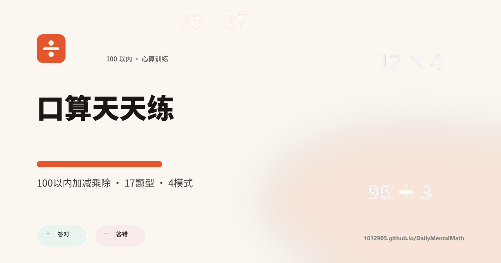

# 🧮 口算天天练 · DailyMentalMath

[](https://1012905.github.io/DailyMentalMath/)
[](https://github.com/1012905/DailyMentalMath/actions/workflows/deploy-pages.yml)
[](./LICENSE)

**100 以内加减乘除 · 17 题型 · 4 模式 · 成就系统 · 数据统计**

网页版（Solid.js + Vite）为主：打开即用、可安装成手机/桌面应用、断网也能练；同一份代码也可用 Tauri 2 打包成桌面程序。纯前端，**没有任何后端和账号**，练习记录只存在你自己浏览器的 localStorage 里。

<p align="center">
  
</p>

---

## 🌐 在线体验

**👉 <https://1012905.github.io/DailyMentalMath/>**

不需要注册，打开就能开始。第一次访问之后会缓存整个应用，之后**断网也能正常做题**。

### 装到桌面 / 手机（PWA）

| 平台 | 操作 |
|------|------|
| Android / Chrome | 地址栏右侧「安装」图标，或菜单 →「安装应用」 |
| iOS / Safari | 分享 ⬆️ →「添加到主屏幕」 |
| Windows / macOS 桌面 | Chrome / Edge 地址栏右侧的安装图标 |

装好后是一个独立窗口的 App，有应用图标、可离线启动，和原生应用体验一致。

---

## ✨ 功能一览

### 🏋️ 17 种题型（4 大类）

| 分类 | 题型 |
|------|------|
| **基础运算** | 两位加减 · 凑整百练习 |
| **进阶运算** | 三位数加法 · 三位数减法 · 三位数加减 · 多数相加 · 混合加减 · 乘法估算 |
| **乘法专练** | 两位数×一位数 · 三位数×一位数 · 两位数×11 · 两位数×15 · 两位数×两位数 |
| **除法专练** | 三位数÷一位数 · 三位数÷两位数 · 五位数÷三位数 · 三位数÷四位数 |

题型可以按大类勾选组合，也可以只练某一类。

### 🎮 4 种练习模式

- **🏃 自由练习** — 无限出题，随时结束，没有时间压力
- **⏱️ 限时冲刺** — 60 秒倒计时，答错扣 2 秒
- **📅 每日挑战** — 按日期生成 20 道固定题，天天不同
- **🔁 错题重练** — 从历史错题里随机抽题，针对性巩固

### 🏆 成就与统计

- 8 个成就徽章：连击、速度、准确率、夜练、完美日赛等维度，实时进度追踪
- 每次练习的准确率、平均耗时、连续答对
- 最近 10 次的准确率 / 用时趋势图表

### 🌍 其它

- 简体中文 / English 双语，首次访问跟随系统语言
- 亮色 / 暗色主题
- 数字键盘贴底，手机上单手可点；也支持物理键盘直接输入
- 离线可用，数据只存在本机（localStorage，`dmm-` 前缀）

---

## 🚀 本地开发

```bash
npm install          # 安装依赖
npm run dev          # 开发服务器 → http://localhost:1422
npm test             # 运行单元测试（Vitest）
npm run build        # 生产构建 → dist/index.html（单文件）
npm run preview      # 预览构建产物
```

需要 **Node 20+**。

Tauri 桌面开发（Windows 需先加载 MSVC 环境，见 `dev.ps1` / `run-msvc.sh`）：

```bash
npm run tauri dev
npm run tauri build
```

### 生成图标与分享图

图标不是二进制素材，全部由脚本从零画出来（Pillow），改配色后重跑即可：

```bash
npm run icons        # → public/favicon.svg, favicon-32.png, apple-touch-icon.png,
                     #   icon-192.png, icon-512.png, icon-maskable-512.png, og-image.png
```

需要 Python 3 + `Pillow`。`npm run icons -- --preview` 会额外输出一张设计校对图。

### 重新生成自托管字体

`public/fonts/` 里的 woff2 由脚本按 `src/`（含 `src/lib/locales/`）里实际出现的中文字符子集化下载：

```bash
npm run fonts        # 重新抓取 public/fonts/*.woff2 + fonts.css
```

**往界面里加了新的中文文案时请重跑一次**，否则新字会回落到系统字体（不会变成豆腐块，但字形会不一致）。

---

## 🏗️ 构建产物

`vite-plugin-singlefile` 把 JS / CSS 全部内联，页面本体是一个 HTML 文件：

| 文件 | 体积 | gzip |
|------|------|------|
| `dist/index.html` | ~111 kB | ~34 kB |
| `dist/fonts/noto-sans-sc-subset.woff2` | ~167 kB | — |
| `dist/fonts/inter-var-subset.woff2` | ~36 kB | — |
| `dist/og-image.png` | ~112 kB | — |
| `dist/*.png`（图标） | 合计 ~65 kB | — |

- **零外部依赖**：没有 CDN、没有第三方脚本、没有 Google Fonts 请求，构建产物里不存在任何外部 `src`/`href` 子资源。
- 字体是 **Inter + Noto Sans SC 的可变字体子集**（只含项目里用得到的字符），首次访问后由 Service Worker 缓存。
- CI 里有一条 guard 会在构建后检查产物，一旦引入外部资源直接让流水线失败。

---

## 📦 部署到 GitHub Pages

站点地址：**<https://1012905.github.io/DailyMentalMath/>**（仓库子路径，`base: "./"`）

### 方式一：GitHub Actions（推荐）

1. 把 `package-lock.json` 提交进仓库 —— CI 用的是 `npm ci`，**没有 lockfile 会直接失败**。
2. 仓库 **Settings → Pages → Source** 选择 **GitHub Actions**。
3. `git push origin main`。

`.github/workflows/deploy-pages.yml` 会自动执行：
`npm ci` → `npm test` → `npm run build` → 产物 guard → `upload-pages-artifact` → `deploy-pages`。

### 方式二：本地一键发布

```bash
npm run deploy:pages              # 检查工作区 → npm ci → test → build → 校验产物
                                  # 然后提示你 push main 走 Actions
npm run deploy:pages -- --gh-pages    # 直接把 dist/ 强推到 gh-pages 分支
```

其它参数：`--out-dir DIR`（不动 `dist/` 做干跑）、`--skip-install`、`--skip-tests`、`--allow-dirty`、`-y`。`--help` 看全部。

---

## 🖼️ 截图

仓库暂未内置运行截图。要补充的话，把三档视口的图放到 `docs/screenshots/`，然后在这里引用：

| 视口 | 文件 |
|------|------|
| 手机 375×812 | `docs/screenshots/mobile-375.png` |
| 平板 768×1024 | `docs/screenshots/tablet-768.png` |
| 桌面 1440×900 | `docs/screenshots/desktop-1440.png` |

```markdown
| 手机 | 平板 | 桌面 |
|------|------|------|
|  |  |  |
```

分享图 `public/og-image.png`（1200×630）由 `npm run icons` 生成，链接分享出去时就是这个卡片。

---

## 🗂️ 项目结构

```
DailyMentalMath/
├── index.html              # 入口：SEO / Open Graph / JSON-LD / PWA 注册
├── public/                 # 原样拷贝到 dist/ 的静态资源
│   ├── manifest.webmanifest
│   ├── sw.js               # Service Worker（应用外壳预缓存）
│   ├── favicon.svg         #                          ┐
│   ├── favicon-32.png      #                          │ npm run icons 生成
│   ├── apple-touch-icon.png#                          │
│   ├── icon-192.png / icon-512.png / icon-maskable-512.png
│   ├── og-image.png        #                          ┘
│   └── fonts/              # 自托管 Inter + Noto Sans SC 子集
├── scripts/
│   ├── gen-icons.py        # 从零生成图标与分享图（Pillow）
│   ├── fetch-fonts.py      # 下载并子集化自托管字体
│   └── deploy-pages.sh     # 一键校验 / 构建 / 发布
├── .github/workflows/deploy-pages.yml
├── src/
│   ├── App.jsx             # 主组件 — 页面切换 / 成就 / 图表
│   ├── index.jsx           # 入口 — render(<App />, #root)
│   ├── pwa.js              # Service Worker 注册（生产构建才注册）
│   ├── style.css           # 全局样式（LightningCSS）
│   ├── styles/tokens.css   # CSS 自定义属性主题系统
│   ├── components/         # PracticePanel / Numpad / StatsPanel / ...
│   ├── hooks/              # usePractice / useTheme / useLocale
│   └── lib/                # math.js（题型引擎）· i18n · locales
├── src-tauri/              # Tauri 2 桌面壳（Rust）
└── vite.config.js
```

---

## 🛠️ 技术栈

| 层 | 技术 |
|----|------|
| 前端框架 | [Solid.js](https://www.solidjs.com/) + [Vite 6](https://vitejs.dev/) |
| 离线 / 安装 | 手写 Service Worker + Web App Manifest（无 Workbox） |
| 字体 | 自托管 Inter / Noto Sans SC 可变字体子集 |
| 样式 | LightningCSS + CSS 自定义属性主题系统 |
| 存储 | localStorage（无后端、无账号、无埋点） |
| 测试 | [Vitest](https://vitest.dev/) |
| 桌面壳 | [Tauri 2](https://v2.tauri.app/)（可选） |

---

## 🔒 隐私与离线

- 没有服务器，没有账号，没有统计上报；练习数据只写在本机 localStorage。
- 应用本身不发起任何第三方网络请求（字体、图标全部自托管，CI 有 guard 守着）。
- 第一次打开后 Service Worker 会缓存整个应用，之后断网也能正常练习。

---

## 📄 许可证

Copyright © 2025

本程序是自由软件：您可以根据自由软件基金会发布的 **GNU 通用公共许可证**（GPL）第三版，或（凭您选择）任何更新版本的条款，重新分发和/或修改它。

本程序的分发是希望它有用，但**没有任何担保**；甚至没有适销性或特定用途适用性的默示担保。详情请见 GNU 通用公共许可证。

随本程序应附有一份 GNU 通用公共许可证副本；仓库根目录的 [`LICENSE`](./LICENSE) 即为此副本。如果没有，请见 <https://www.gnu.org/licenses/>。

```
This program is free software: you can redistribute it and/or modify
it under the terms of the GNU General Public License as published by
the Free Software Foundation, either version 3 of the License, or
(at your option) any later version.

This program is distributed in the hope that it will be useful,
but WITHOUT ANY WARRANTY; without even the implied warranty of
MERCHANTABILITY or FITNESS FOR A PARTICULAR PURPOSE.  See the
GNU General Public License for more details.

You should have received a copy of the GNU General Public License
along with this program.  If not, see <https://www.gnu.org/licenses/>.
```
